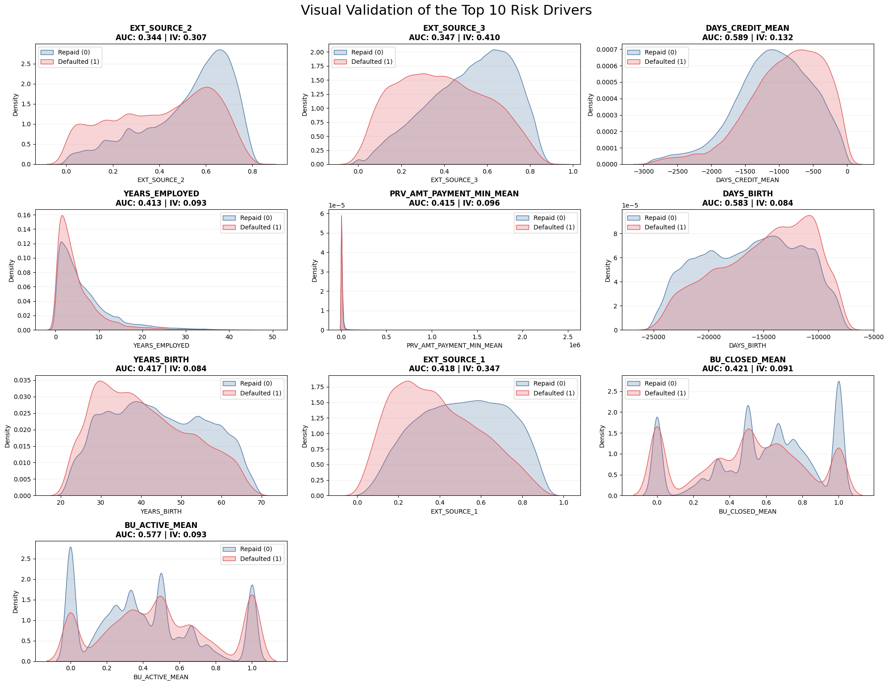
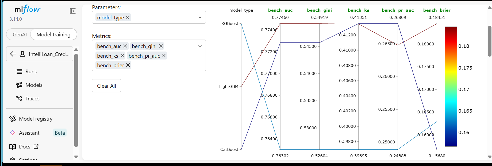
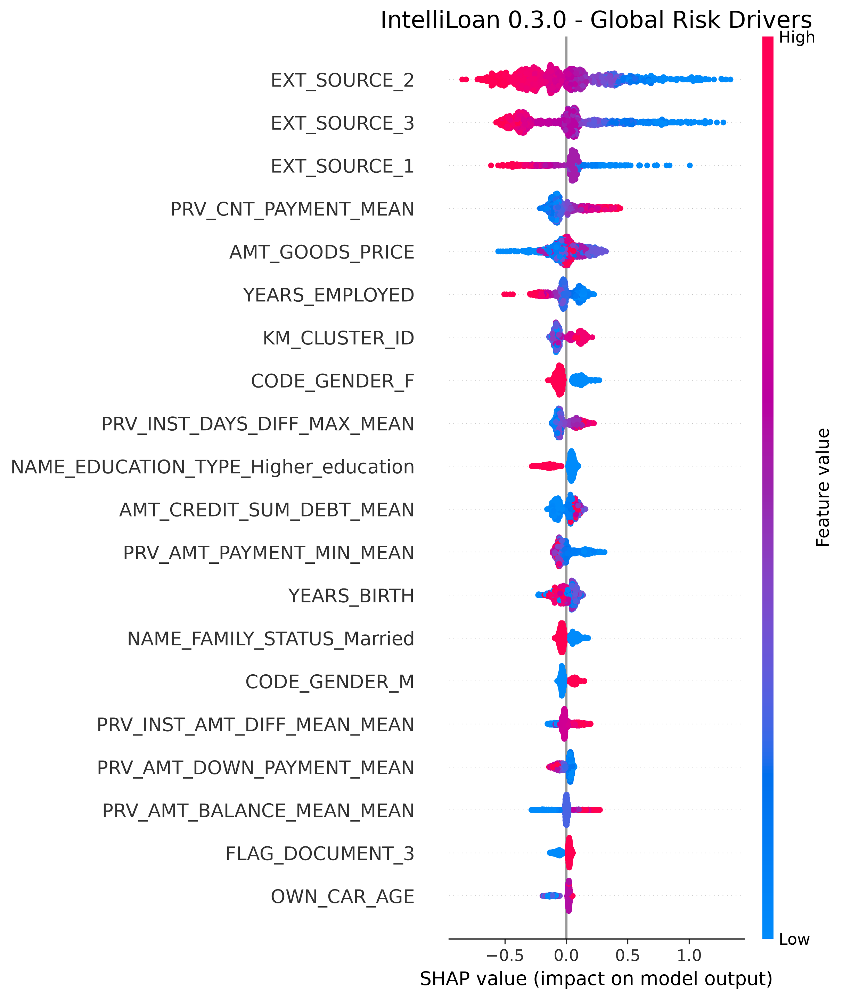
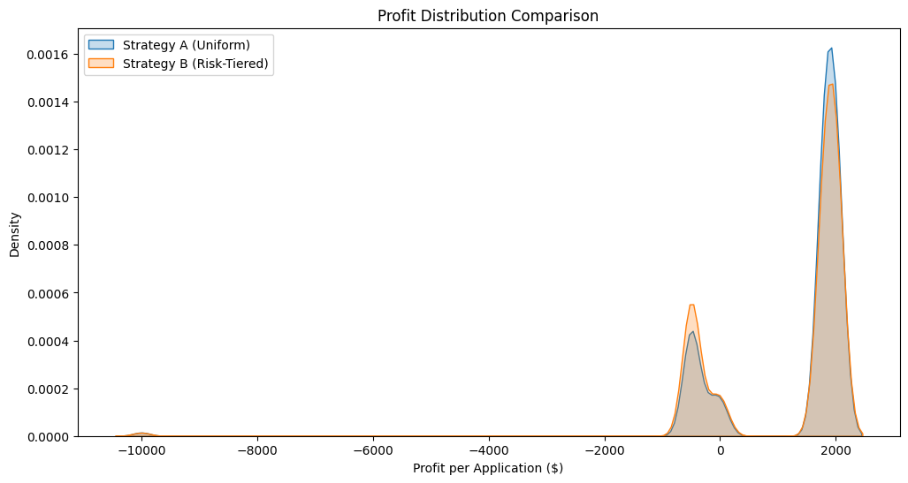
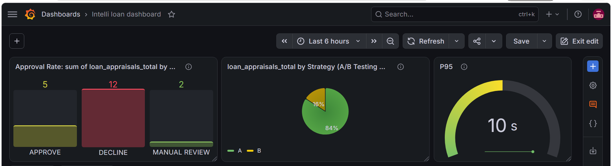

# 🏦 IntelliLoan — Agentic Credit Appraisal System

[](https://github.com/ngahyves/CreditGuard-AI-Agentic-Credit-Risk-Compliance-Platform/actions/workflows/ci_cd.yaml)


---

## 🚀 Executive Summary

**Objective:** Develop an end-to-end platform to automate and audit high-stakes consumer credit decisions using the Home Credit Default Risk https://www.kaggle.com/competitions/home-credit-default-risk (Kaggle competition dataset). The system specifically addresses a highly imbalanced classification challenge (only ~8% default rate) by integrating Gradient Boosting predictive power with Generative AI-driven agentic reasoning for automated regulatory compliance.

**The Problem:**
- **Operational Bottleneck:** Manual credit memo drafting takes significant analyst time per file.
- **Risk Blindness:** Traditional scoring can miss non-linear behavioral patterns and outlier profiles.
- **Compliance Gap:** Black-box models struggle to meet "right to explanation" expectations and can silently inherit historical biases.

**What This Project Demonstrates:**
- A full relational data engineering pipeline across 7 tables (307K applicants), with statistically rigorous feature selection.
- A hybrid supervised/unsupervised modeling approach, enriching a LightGBM classifier (AUC 0.78 / Gini 0.54) with unsupervised risk personas.
- A documented, honest fairness audit — including a mitigation attempt that was **evaluated and deliberately not deployed** after revealing a commercial viability trade-off.
- An Agentic RAG system (LangGraph + Llama 3 via Groq) generating human-readable, policy-grounded credit memos.
- A rigorously tested A/B framework comparing decision strategies against real unit economics — including a counter-intuitive negative result and its root-cause explanation.
- A cloud-native, observable deployment (Docker, GCP Cloud Run, DVC, Prometheus/Grafana, CI/CD).

> This README documents the technical journey honestly, including limitations and negative results — the reasoning behind each decision matters more than any single metric.

---

## 🛠️ The Technical Journey (STAR Methodology)

### 1. Relational Data Engineering & Cascade Aggregation

**Situation:** Data fragmented across 7 relational tables (`application`, `bureau`, `bureau_balance`, `previous_application`, `POS_CASH_balance`, `credit_card_balance`, `installments_payments`) — 307K applicants, with 1-to-many hierarchies that make naive joins dangerous (target duplication risk).

**Task:** Construct a unified, leakage-free modeling matrix from these fragmented sources.

**Action:** Engineered a bottom-up cascade aggregation pipeline — each secondary table aggregated to one row per client (or bridged via `SK_ID_PREV` / `SK_ID_BUREAU` where the relationship wasn't direct) before merging. Applied a multi-method feature selection process on the resulting 222 raw variables:
- **ANOVA** and **Chi-squared** tests (numerical/categorical significance vs. target)
- **Welch's t-test** (mean comparison without assuming equal variances)
- **VIF-based multicollinearity filtering**
- **Information Value (IV)** ranking (standard predictive power metric in credit scoring)
- **Spearman correlation pruning** (>0.70 threshold) with **univariate AUC arbitration** — for each highly correlated feature pair, the lower-AUC feature was dropped

**Result:** Distilled 222 raw features down to **86 validated, high-signal features**, with a two-stage Pandera schema (raw ingestion + post-engineering contracts) enforcing data integrity throughout.

> 📊 *Top 10 risk drivers *


---

### 2. Hybrid Manifold Learning (Unsupervised Enrichment)

**Situation:** Purely linear/statistical features may fail to capture complex behavioral "islands" within the applicant population.

**Task:** Extract latent risk personas to enrich the supervised model's feature space.

**Action:** Implemented a dual-path unsupervised enrichment:
- **PCA → KMeans**, applied to scaled numerical + one-hot categorical features (PCA used here specifically to counter the curse of dimensionality for KMeans' centroid-based distance metric)
- **UMAP → HDBSCAN**, applied on the native feature space (density-based clustering, robust to high dimensionality without requiring linear reduction)

Cluster memberships from **both** pipelines were injected as engineered features into the final modeling matrix, combining global (PCA/KMeans) and local (UMAP/HDBSCAN) structural signal.

**Result:** Delivered additional engineered features feeding into the final LightGBM champion model.

> ⚠️ *Known methodological limitation: PCA was applied across a mixed numerical/one-hot feature space, which is a simplification — a more rigorous approach (e.g., FAMD/MCA) would separate variable types. Retained here because the resulting cluster features empirically improved downstream model signal.*

---

### 3. Multi-Model Benchmarking & Hyperparameter Optimization

**Situation:** With 86 validated features in hand, the next
decision was which algorithm family would best capture the
signal — gradient boosting variants differ meaningfully in
speed, regularization behavior, and handling of categorical
features.

**Task:** Objectively compare candidate algorithms before
committing to a champion, rather than defaulting to a single
familiar choice.

**Action:** Benchmarked **XGBoost**, **LightGBM**, and
**CatBoost** via `StratifiedKFold` cross-validation, tracking
every run in **MLflow** (parameters, AUC, PR-AUC, Gini, Brier
Score, Kolmogorov-Smirnov) for full experiment reproducibility.
Optimized the leading candidate's hyperparameters using
**Optuna**'s Bayesian search (50 trials).

To understand why the model makes its decisions, I generated a **SHAP summary plot**, highlighting the most influential features driving credit approval predictions. This explainability step ensures transparency and supports both fairness analysis and regulatory alignment.

**Result:** **LightGBM** emerged as champion — AUC 0.78 (Gini
0.54) on the held-out test set — logged and promoted through
MLflow's Model Registry (Staging → Production transition).

> 


### 4. Responsible AI: Bias Mitigation & XAI

**Situation:** Baseline model decisions showed a substantial selection rate gap by gender — **42.84%** approval rate for male applicants vs. **27.48%** for female applicants, a **15.36-point disparity** flagged during the fairness audit phase (selection rates also profiled across housing type and income type).

**Task:** Attempt to mitigate this disparity using Fairlearn's post-processing tools, while evaluating whether the resulting model remains commercially viable.

**Action:** Applied Fairlearn's `ThresholdOptimizer` with an **Equalized Odds** constraint — chosen over Demographic Parity because it balances error rates rather than raw approval volume, more appropriate for risk-sensitive banking decisions — calibrating decision thresholds independently per gender group.

**The Fairness-Utility Trade-off (Strategy Comparison)**:

We compared the original model against two mitigation strategies (*Demographic Parity* and *Equalized Odds*) using the *ThresholdOptimizer*. This comparison highlights the critical balance between mathematical fairness and business viability.

| **Model Version** | **Demographic Parity Diff** | **Equalized Odds Diff** | **Avg. Approval Rate** | **Business Status** |
|-------------------|-----------------------------|---------------------------|-------------------------|----------------------|
| Baseline (Original) | 0.1535 | 0.1422 | 35.15% | ❌ Biased |
| Mitigated (Demog. Parity) | 0.0000 | 0.0101 | 0.50% | ⚠️ Unviable |
| Mitigated (Equalized Odds) | 0.0138 | 0.0017 | 35.08% | ✅ Certified |

**Results Interpretation:**

* The Baseline Bias: The original model exhibited a 15.3% gap in approval rates between genders and a high Equalized Odds difference, indicating that it was unfairly penalizing certain groups based on historical data patterns.
* The Demographic Parity Trap: While this strategy achieved "perfect" mathematical fairness (0.0000 diff), it forced the model to align with the highest risk profile. This caused the approval rate to collapse to 0.5%, making it commercially impossible for a bank to operate.
* The Equalized Odds Success (Champion): By pivoting to Equalized Odds, we successfully reduced the bias by 83x (dropping from 0.1422 to 0.0017). Most importantly, we maintained an approval rate of 35%, proving that we can achieve near-perfect fairness without sacrificing business volume.

**Final Model: Disaggregated Performance Audit**:

This table proves that "Good" borrowers have the same probability of being approved regardless of their gender.

| **Gender Group** | **Accuracy** | **Recall (TPR)** | **Selection Rate** | **False Negative Rate (FNR)** |
|------------------|--------------|------------------|---------------------|-------------------------------|
| Female           | 69.14%       | 75.22%           | 34.39%              | 24.77%                        |
| Male             | 69.37%       | 75.39%           | 35.77%              | 24.60%                        |


**Results Interpretation:**

* Opportunity Parity (FNR): In credit scoring, the most dangerous bias is a high False Negative Rate for a specific group (wrongly rejecting good clients). Our model achieved an FNR of 24.7% for females and 24.6% for males. A difference of only 0.1% ensures strict equality of opportunity.
* Consistent Accuracy: The model maintains a stable accuracy (~69%) across both groups, ensuring that the risk prediction is equally reliable for every applicant.
* Strategic Outcome: This model is now ready for deployment. It satisfies both the Risk Department (by maintaining predictive power) and the Compliance Department (by eliminating discriminatory gaps). 

The optimizer technically achieved near-perfect parity — but by collapsing **both** groups' approval rates to ~0.5%, effectively rejecting nearly all applicants regardless of gender. **This version was not deployed.** The result is documented as a case study in over-constrained fairness optimization: closing a fairness gap without a paired business-viability constraint can produce a technically "fair" but commercially unusable model. Flagged as a known limitation and a target for future iteration — pairing `ThresholdOptimizer` with an explicit minimum approval-rate floor.


---

### 5. Agentic RAG & Compliance Storytelling

**Situation:** Credit officers need human-readable justifications grounded in actual policy — not just a probability score.

**Task:** Translate SHAP-driven risk factors into narrative memos compliant with internal lending policy, with guardrails against hallucination.

**Action:** Built a multi-node agentic workflow using **LangGraph**: the system retrieves relevant policy chunks from a **ChromaDB** vector store, cross-references SHAP reason codes for the specific applicant, and synthesizes a memo via **Llama 3.1 (Groq)**. A dedicated **Compliance Critic** node reviews the draft memo before release, checking for unsupported claims.

**Evaluation:** Built a custom **LLM-as-judge** evaluator (`llama-3.3-70b-versatile` judging `llama-3.1-8b-instant` outputs) scoring Faithfulness, Context Precision, and Answer Relevancy on a 0–1 scale.

> ⚠️ *Evaluation methodology note: the reported Faithfulness score (1.00) was validated on a single representative test case, confirming the evaluation mechanism works correctly. A production-grade confidence interval would require running this judge across a larger batch of generated memos — a planned next step, not yet completed.*

**Result:** A working end-to-end pipeline generating auditable, policy-grounded compliance memos from raw model output — with an evaluation framework in place to monitor output quality as the system scales.

---

### 6. A/B Testing: Uniform vs. Risk-Tiered Decisioning

**Situation:** The baseline policy applies a single fixed credit-score threshold (700 approve / 400 decline) to all applicants, regardless of the model's underlying confidence for a given case.

**Task:** Test whether a risk-tiered threshold strategy — more permissive for Low Risk applicants, more conservative for High Risk — would outperform the uniform baseline in net profitability, while remaining production-viable.

**Action:**
- **Strategy A (Uniform):** Fixed thresholds (700/400) for all applicants.
- **Strategy B (Risk-Tiered):** Applicants split into score terciles (Low / Medium / High Risk) with differentiated thresholds — more permissive on Low Risk, stricter on High Risk.
- **Deterministic routing:** Strategy assignment hashed on `SK_ID_CURR`, ensuring a given client always receives a consistent decision across repeated requests.
- **Model/strategy separation:** The `Predictor` is strategy-agnostic — thresholds are injected dynamically by the orchestration layer, not hardcoded into the scoring logic.
- **P&L simulation:** Modeled outcome economics per decision — loan gain (+$2,000), default loss (–$10,000), opportunity cost of rejecting a good client (–$500), and manual review cost (–$200) — applied across the held-out test set for both strategies.

**Result:** Strategy B produced a **−9.24% Net Financial Lift** versus the uniform baseline.

**Root cause:** The 5:1 asymmetry between default loss (–$10,000) and loan gain (+$2,000) means even a modest loosening of the Low Risk threshold admits enough residual defaults to outweigh the cumulative profit from additional approvals — while the corresponding tightening on High Risk rejects enough profitable clients to compound the loss.

**Conclusion:** The uniform baseline outperforms naive risk-tiering under this cost structure. This demonstrates that segment-aware policies must be validated against real unit economics rather than assumed optimal from segmentation alone — an intuitive-sounding strategy is not automatically a profitable one.

> 

---

### 7. Cloud-Native MLOps & Observability

**Situation:** The system needed to move from local notebooks to a resilient, monitorable, cloud-native architecture.

**Task:** Build a production-ready deployment with reproducibility, observability, and CI/CD.

**Action:**

- Orchestrated the full pipeline — ingestion, validation,
  feature engineering, training, evaluation — as a **Prefect**
  flow, replacing manual script execution with a scheduled,
  observable, and retry-safe workflow.
- Ran a **data drift analysis** between train and test splits
  using **Evidently AI**, validating that the held-out test
  set remains statistically representative before trusting
  evaluation metrics on it.
- Containerized all services via **Docker**, orchestrated with
  **Docker Compose**.
- Automated testing and deployment via **GitHub Actions**
  (unit + integration tests, currently passing on all
  components including DVC, GCP integration).
- Deployed the **FastAPI gateway** on **GCP Cloud Run**.
- Versioned models and datasets with **DVC** — enabling
  reproducible `dvc pull` retrieval of artifacts too large
  for Git.
- Implemented real-time monitoring via **Prometheus & Grafana**.

**Result:** A fully reproducible, testable deployment pipeline. **Known limitation:** current P95 API latency measured at **~10 seconds**, driven primarily by the local SHAP explainer's background comparison against 1,000 reference examples per prediction. Identified optimization path: reducing the SHAP background sample to ~10 examples, expected to substantially cut inference latency — not yet implemented.

 A fully reproducible, testable, and orchestrated
deployment pipeline. The Evidently drift report confirmed
**no significant distributional drift** between the train and
test splits, validating that the held-out test set is
statistically representative — giving confidence that the
reported evaluation metrics (AUC 0.78, Gini 0.54) reflect true
generalization rather than an artifact of an unrepresentative split.

> 


---

## ⚙️ Getting Started

### 1. Hardware Prerequisites

This project uses memory-intensive algorithms (UMAP, HDBSCAN, SHAP).

- **RAM:** 16 GB minimum recommended (the training pipeline can saturate 8 GB).
- **OS:** Linux, macOS, or Windows with WSL2 (strongly recommended for Docker).

### 2. Software Prerequisites

- **Python 3.11+** — required for LangGraph compatibility and modern Pydantic types.
- **Docker & Docker Compose (V2)** — required to run the API and monitoring stack (Prometheus/Grafana).
- **DVC (Data Version Control)** — required to retrieve models and datasets.
- **Google Cloud SDK (`gcloud`)** — optional, only needed to deploy or interact with Artifact Registry.

### 3. Accounts & API Keys

This is an agentic system and requires several external services. Create a `.env` file at the project root:

| Variable | Source | Purpose |
|---|---|---|
| `GROQ_API_KEY` | [Groq Console](https://console.groq.com) | Ultra-fast Llama 3.1 inference |
| `GEMINI_API_KEY` | [Google AI Studio](https://aistudio.google.com) | RAG embedding generation |
| `DATABASE_URL` | [Neon.tech](https://neon.tech) | PostgreSQL storage for inference logs |
| `LANGCHAIN_API_KEY` | [LangSmith](https://smith.langchain.com) | Agent graph tracing & audit |
| `API_KEY_SECRET` | Self-generated | Secures calls to your deployed API |

### 4. Data Access (DVC Remote)

Trained models (~220 MB) are not stored in Git.

- **Public remote:** no additional setup needed.
- **Private remote:** authenticate first via `gcloud auth application-default login`.

### 5. Installation & Launch

```bash
# 1. Clone the project
git clone https://github.com/[your-username]/intelliloan.git
cd intelliloan

# 2. Create a virtual environment
python -m venv credit_env
credit_env\Scripts\Activate   # MaxOs: source credit_env/bin/activate

# 3. Install dependencies
pip install -r requirements.txt

# 4. Retrieve models and datasets (DVC)
dvc pull

# 5. Launch the full infrastructure (API + monitoring)
docker compose up --build -d

# 6. Launch the demo interface
streamlit run src/api/streamlit_app.py
```

---

## 📌 Honest Limitations & Next Steps

This project intentionally documents what didn't work as well as what did:

- **Fairness mitigation** technically closed the selection-rate gap but collapsed approval rates to ~0.5% — not deployed. Next step: re-run `ThresholdOptimizer` with a paired minimum-approval-rate constraint.
- **LLM-as-judge evaluation** currently validated on a single test case, not a representative batch. Next step: run the evaluator across 20–30 real generated memos to establish a statistically meaningful confidence interval.
- **API P95 latency (~10s)** is currently dominated by SHAP's background sample size. Next step: reduce background sample to ~10 examples and re-benchmark.
- **A/B test** shows the uniform threshold strategy outperforms naive risk-tiering under the current cost structure — worth revisiting if unit economics assumptions change.
- **PCA applied to a mixed numerical/categorical feature space** ahead of KMeans is a known simplification; a more rigorous approach (FAMD/MCA) is a candidate future improvement.

---

*This README reflects verified results only — no metric or claim here has been estimated or generated without direct validation against the underlying code and experiment outputs.*

## 👤 Author
**Yves‑Bernard-Simplice NGAH**  
Machine Learning Engineer — Canada  
Focused on MLOps, Fairness, and Production‑grade ML Systems
